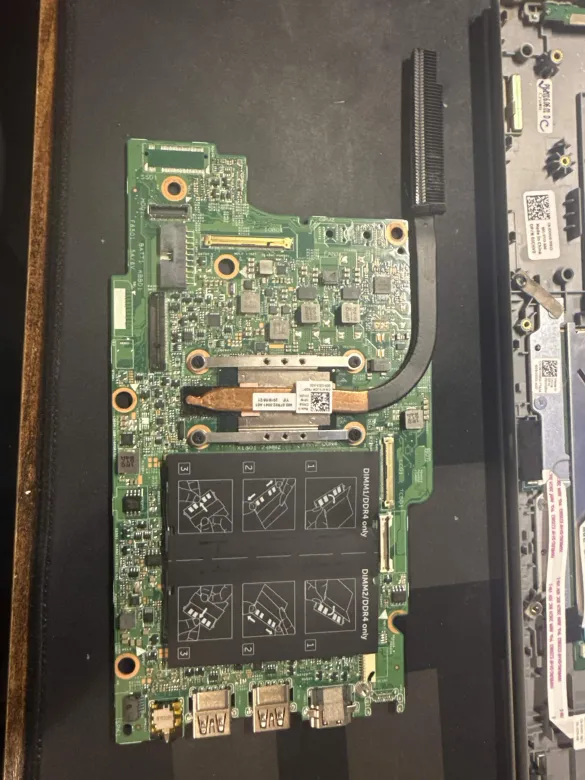
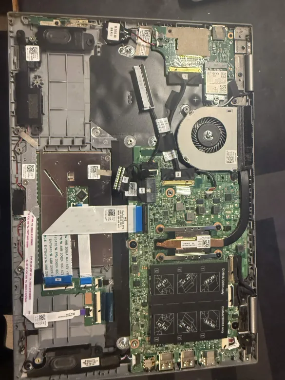

## What I Can See on This Board

From the photo, this appears to be a **Dell Inspiron 3000 or 5000 series** laptop motherboard (15" class), likely Intel-based with DDR4 SO-DIMMs. Here's what's identifiable:

### Confirmed Connectors (visible in image)

| Connector | What it is | Notes |
|---|---|---|
| **DIMM1 / DIMM2 (DDR4 only)** | Two SO-DIMM RAM slots | Labeled on the black shield sticker — 260-pin DDR4 SODIMM |
| **Large ZIF/FPC ribbon** (top center, gold fingers) | LCD/eDP display connector | Connects to the laptop screen panel |
| **M.2 slot** (center, with screw hole) | M.2 SSD (likely NVMe/SATA) | The connector under the heatsink pipe area |
| **USB-A ports** (bottom edge, 2x) | Standard USB 3.0 Type-A | External-facing I/O |
| **USB-C / HDMI** (bottom edge, right) | Video/data out | Likely USB-C with DisplayPort or a dedicated HDMI port |
| **Copper heat pipe** | CPU/GPU thermal solution | Routed to the black heatsink fin stack at top-right |
| **Small FPC connectors** (various) | Keyboard, touchpad, battery, speakers, camera | Thin flat ribbon cable ZIF sockets |
| **Orange screw standoffs** | Mounting points | 4 visible — these are your case mounting holes for repurposing |

---

## For the Full Schematic

Dell does **not** release internal engineering schematics to the public — this has been confirmed repeatedly on their forums. However, there are a few real avenues:

1. **Dell Service Manual** (free, official) — gives connector locations and names but not circuit-level detail. Find it at [dell.com/support](https://www.dell.com/support) by entering your Service Tag (on the bottom of the laptop).

2. **laptopschematic.com** sells boardview (.brd/.cad) files and schematics for many Dell Inspiron models — these are the closest to actual engineering diagrams you'll find publicly.

3. **BadCaps / Louis Rossmann community forums** — repair technicians sometimes share boardview files for common Dell boards.

---

## Tips for Your Repurpose Build

- **Power**: Laptop boards don't use ATX. You'll need the **original Dell barrel jack adapter** (typically 19.5V DC) or wire a DC-DC buck converter to match. The battery connector can also power the board directly if you provide ~11–12V to it.
- **Display**: The eDP connector at the top can drive any compatible laptop panel — you can buy standalone eDP-to-HDMI adapter boards to use a desktop monitor instead.
- **RAM**: The two **DDR4 SO-DIMM** slots are standard — any compatible DDR4 laptop RAM works.
- **Storage**: The M.2 slot should accept standard NVMe or SATA M.2 drives.

If you can share the **Service Tag** or the exact model number (usually printed on a sticker on the board itself), I can pull the exact Dell service manual and give you a precise connector map.

Great, this second photo is much more useful — it shows the board **still in the chassis** with most components connected. Here's what I can now identify more clearly:

---

## Updated Connector Map (from both photos)

### Top Section (rear of chassis)
| Location | Connector | What it does |
|---|---|---|
| **Top-left, large grey slot** | HDD/ODD SATA connector | 2.5" hard drive or optical drive bay |
| **Top-center, two small ribbon ZIFs** | Camera + WiFi antenna cables | Routed up through the display hinge |
| **Top-right, black card with gold fingers** | Wireless/WLAN M.2 card (half-size) | WiFi + Bluetooth card seated in its slot |
| **Right side, fan + heatsink** | CPU cooling fan (4-pin) | The fan connector will be a small JST-style header near the fan |

### Middle Section
| Location | Connector | What it does |
|---|---|---|
| **Large white ZIF ribbon (left-center)** | Keyboard FPC | The wide flat cable — this is a standard laptop keyboard connector |
| **Smaller ZIF ribbons nearby** | Touchpad + power button board | Multiple thin FPC cables routing to palm rest |
| **Blue connectors (bottom-left)** | Speaker cables | Left and right speakers, JST 2-pin style |
| **Battery connector area (left)** | Battery pack connector | Multi-pin JST, supplies main system power |

### Bottom I/O Edge (confirmed from photo 1)
| Port | Type |
|---|---|
| 2× USB-A | USB 3.0 (5Gbps) |
| 1× USB-C or HDMI | Video/data |
| DC barrel jack | 19.5V Dell power input |
| SD card slot | If present on this model |
| 3.5mm audio | Headphone/mic combo |

---

## Key Observations for Your Repurpose Build

**Good news from this photo:**

- The **SATA HDD caddy** (top-left) means you can use a standard 2.5" SATA drive alongside the M.2 — useful for a repurposed build with extra storage.
- The **WiFi card** is a standard M.2 (A+E key) half-size card, fully reusable.
- The **speaker connectors** appear to be simple 2-pin JST — easy to wire to new speakers.
- The **fan is still attached** — keep this. Without it the CPU will throttle or shut down. You'll need to ensure it spins in your new enclosure.

**Challenges for repurposing:**

- The **keyboard ribbon** is a non-standard ZIF cable — you'll either need to keep a laptop keyboard or buy a ZIF-to-USB adapter board (~$10 on Amazon/AliExpress) to use a regular USB keyboard without the board complaining.
- The **power button board** is on a separate FPC — you'll want to trace which pins short to trigger power-on so you can wire a standard momentary switch.
- **No POST without display signal** — some Dell boards require the eDP display connector to have a valid panel, or they won't boot to video. A cheap eDP-to-HDMI adapter board solves this.

---

## Next Steps I'd Recommend

1. **Find your exact model**: Look for a sticker on the board itself (usually near the RAM slots or battery connector) with a part number like `LA-XXXXX` — that's the board revision number and will unlock the exact service manual.
2. **Dell Service Manual**: Once you have the model, go to [dell.com/support](https://dell.com/support), enter the Service Tag or model, and download the *Service Manual PDF* — it has a full labeled diagram of every connector on the board.
3. **Power solution**: Plan around a **19.5V DC power supply** (like a Dell 65W or 90W adapter) going into the barrel jack — this is far easier than trying to adapt ATX.

Do you see any stickers on the board with a part number or service tag? That would let me pull the exact documentation for you.